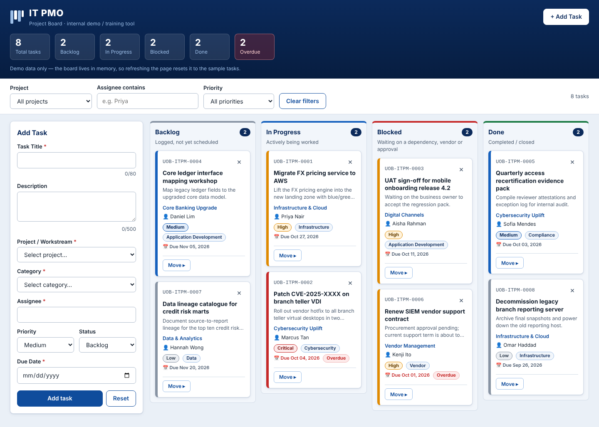

# IT PMO Project Board

A single-page Kanban board for a fictitious bank's internal IT PMO. It is a demo and training tool built with vanilla HTML, CSS and JavaScript in one file, `index.html`.

**Live demo:** https://aarockiadass-prog.github.io/Claude-Project/

## Features

- Four fixed columns: Backlog, In Progress, Blocked, Done, each with a live task count.
- Drag and drop cards between columns, plus a keyboard-accessible "Move ▸" control.
- Priority colour-coding, overdue badges, and an inline "Delete? Yes / No" confirmation.
- Add Task form with inline validation and optimistic updates.
- Filters by project, assignee and priority, and a live summary strip.
- Optional email notification for new tasks through [FormSubmit](https://formsubmit.co).

The board lives in memory only. Refreshing the page resets it to the seeded demo data.

## Run locally

Open `index.html` in a browser. There is no build step and no server is needed.

## Email notifications

Set your address in the `FORMSUBMIT_ENDPOINT` constant at the top of the `<script>` block in `index.html`. FormSubmit sends a one-time confirmation email to that address, and notifications are delivered only after you click the link in it. Until an address is set, the app keeps the card and shows a warning toast.

## Deployment

Pushes to the default branch run `.github/workflows/ci.yml`, which checks the page and deploys `index.html` to GitHub Pages.

## Notes

This is an internal demo. It uses no real bank logo or branding.
