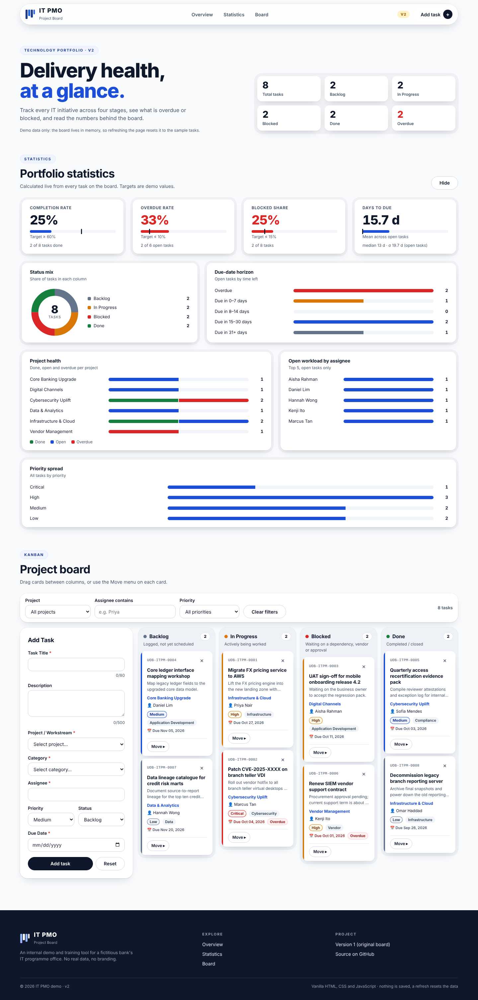

# IT PMO Project Board

A single-page Kanban board for a fictitious bank's internal IT PMO. It is a demo and training tool built with vanilla HTML, CSS and JavaScript in one file, `index.html`.

**Live demo (v1):** https://aarockiadass-prog.github.io/Claude-Project/

**Live demo (v2, redesign with statistics, header and footer):** https://aarockiadass-prog.github.io/Claude-Project/v2/

v1 stays at the site root and is not replaced; v2 is published alongside it under `/v2/` (source: `v2/index.html`).

**v2:**

## Features

- Four fixed columns: Backlog, In Progress, Blocked, Done, each with a live task count.
- Drag and drop cards between columns, plus a keyboard-accessible "Move ▸" control.
- Priority colour-coding, overdue badges, and an inline "Delete? Yes / No" confirmation.
- Add Task form with inline validation and optimistic updates.
- Portfolio statistics dashboard: completion, overdue and blocked rates, mean/median/std dev of days to due, and breakdowns by status, priority, project and assignee.
- Filters by project, assignee and priority, and a live summary strip.
- Optional email notification for new tasks through [FormSubmit](https://formsubmit.co).

The board lives in memory only. Refreshing the page resets it to the seeded demo data.

## Run locally

Open `index.html` (v1) or `v2/index.html` (v2) in a browser. There is no build step and no server is needed.

## Email notifications

Set your address in the `FORMSUBMIT_ENDPOINT` constant at the top of the `<script>` block in `index.html`. FormSubmit sends a one-time confirmation email to that address, and notifications are delivered only after you click the link in it. Until an address is set, the app keeps the card and shows a warning toast.

## Deployment

Pushes to the default branch run `.github/workflows/ci.yml`, which checks both pages and deploys `index.html` to the site root and `v2/index.html` to `/v2/` on GitHub Pages.

## Notes

This is an internal demo. It uses no real bank logo or branding.
